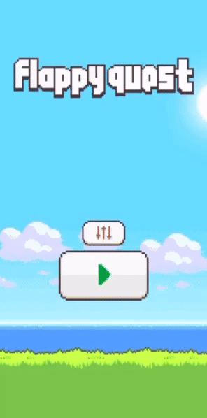

# FlappyQuest
Basically a Flappy Bird story-mode for iOS.

# Development
Development is slow because it's just me working on it, So there is no ETA for release yet.

I will release a beta version once there is a playable gamemode.
# License
• MIT

• Copyright (c) 2023 - 2023 Man Guy, Man Guy (Flappy Quest Team)
# Notice
I do not own most of the assets in this game, Most of the assets come from FlappyBird itself.

They are the work and copyright of Dong Nguyen and .GEARS games
(http://www.dotgears.com)

I took this Tweet

(http://i.imgur.com/AcyWyqf.png)

by Dong Nguyen, the creator of the game, as an open invitation to reuse the game concept and assets in an open-source project.
There is no intention to steal the game.

If the copyright holder would like the assets to be removed, please open an issue to start the conversation.
